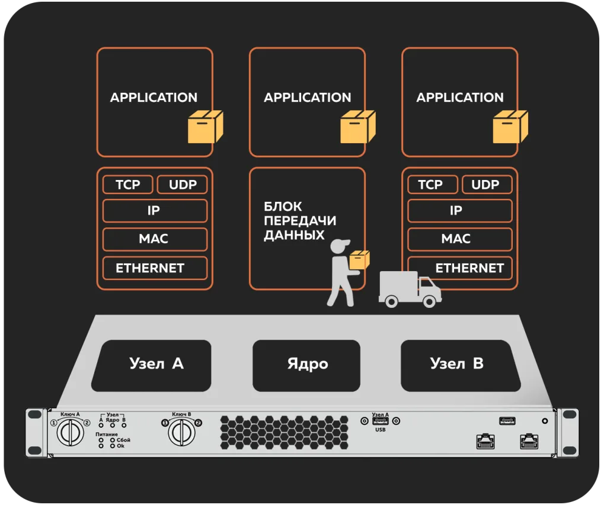

# nstu-sinonix-case
# Стенд контролируемого информационного обмена на базе ПК «Синоникс»
## Аннотация
Технологический сегмент значимого объекта КИИ изолируется от корпоративной сети, но данные между сегментами передавать всё равно нужно: телеметрию — наверх, обновления и задания — вниз. Задача решается системами контроля информационного обмена, аппаратно разделяющими сегменты и пропускающими только данные разрешённого формата, прошедшие проверку. Команда работает со стендом из двух изолированных сегментов, настраивает разрешающие правила обмена на обоих узлах, разрабатывает прикладные сервисы-источники и приёмники данных, проводит испытания и оформляет результат в виде готового лабораторного практикума для кафедры.

---

## Cтек технологий
*	**Средство защиты**: программно-аппаратный комплекс «Синоникс» (сертификат ФСТЭК России, реестр российского ПО)
*	**Операционные системы**: Astra Linux, Debian, Windows (виртуальные машины технологического и корпоративного сегментов)
*	**Языки программирования**: Python (эмулятор источника и коллектор-приёмник данных, автоматизация передачи по SFTP)
*	**Проверка передаваемого содержимого**: ICAP-сервер с антивирусной проверкой — Dr.Web, c-icap + ClamAV
*	**Средства диагностики и измерений**: Wireshark/tcpdump (анализ трафика, подтверждение отсутствия обратного канала в однонаправленном сценарии), iperf3 (замер пропускной способности и задержки)
*	**Системы автоматизации развёртывания**: Ansible, Docker
*	Опционально — эмуляция технологической телеметрии: эмулятор Modbus, эмулятор МЭК-104, брокеры-MQTT. 

---

## Ожидаемый результат
1. **Развёрнутый и задокументированный стенд**: технологический и корпоративный сегменты, комплекс «Синоникс» между ними, схема сети и паспорт стенда.
2. **Настроенные и проверенные сценарии обмена**: непрерывная передача телеметрии в одно- и двунаправленном режиме передачи данных (TCP/UDP), автоматизированная доставка файлов обновлений (SFTP/FTP) с проверкой маски и размера файла, контролем целостности и внешней проверкой по протоколу ICAP.
3. **Прикладная обвязка, разработанная командой**: эмулятор источника технологических данных и коллектор-приёмник, скрипты автоматизации регулярной передачи.
4. **Программа и протокол испытаний**: подтверждение анализом трафика отсутствия обратного канала, проверка срабатывания запрещающих правил на «неправильных» данных, замеры пропускной способности и задержки.
5. **Комплект методических материалов**: 2–3 лабораторные работы с заданиями, порядком выполнения и критериями оценивания, пригодные для встраивания в дисциплины кафедры.
6. Отчёт с сопоставлением реализованных на стенде функций мерам приказов ФСТЭК России № 239 и № 31 в части сегментации и контроля межсетевого взаимодействия.

